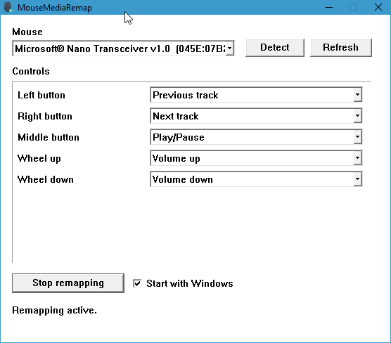

# MouseMediaRemap

Turn a spare USB mouse into a **media remote** on Windows — no driver rebinding, no admin rights for normal use.

While remapping is on, the selected mouse’s buttons and wheel send media keys (and don’t move the cursor). Your other mouse or touchpad still works normally. Stop remapping (or exit) and every mouse is a pointer again.



## Features

- Session remapping via Raw Input + a low-level mouse hook (HID drivers stay installed)
- Per-device control mappings (buttons, wheel, horizontal wheel when present)
- **Detect…** — press a button on the target mouse to select it
- Remembers last device, mappings, and whether remapping was active
- Tray icon (idle = red stop badge, active = teal play badge) with Start/Stop
- **Start with Windows** — launches minimized to the tray; remapping state is restored from last session
- Hotkey **Ctrl+Shift+F8** stops remapping

**Note:** While remapping, other pointers are reinjected with `SendInput`. Some game anti-cheats dislike that — turn remapping off for those games.

## Requirements

- Windows 10 or later (x64)
- A second pointing device while remapping (so you can still move the cursor)

## Usage

1. Run `MouseMediaRemap.exe`.
2. Pick the spare mouse (**Detect…** or the dropdown) and set mappings.
3. Click **Start remapping** (or use the tray menu).
4. Optionally enable **Start with Windows**.
5. **Stop remapping** when you want that mouse to act as a pointer again.

Settings are stored in `%AppData%\MouseMediaRemap\settings.ini`.

## Build

Requires [MSYS2](https://www.msys2.org/) MinGW-w64 (or another MinGW toolchain with CMake + Ninja):

```bash
pacman -S --needed mingw-w64-x86_64-gcc mingw-w64-x86_64-cmake mingw-w64-x86_64-ninja
export PATH="/mingw64/bin:$PATH"

cmake -S . -B build -G Ninja -DCMAKE_BUILD_TYPE=Release
cmake --build build
```

The binary is fully statically linked (`-static`) so it runs without MinGW DLLs: `build/MouseMediaRemap.exe`.

## Releases

GitHub Releases build and attach `MouseMediaRemap.exe` automatically when a release is published. Create a release (tag such as `v1.0.0`) and the workflow uploads the executable to that release.

## What does the fox say?

This is the kind of app that nobody other than me probably needs at all - I just had a small wireless mouse sitting around the house I wanted to use as a simple media remote instead of having to buy a dedicated one.

If you find the app useful, I don't mind [donations](https://www.paypal.me/MuiluFox) but don't feel obligated to, this is freeware and vibe coded in a few hours.